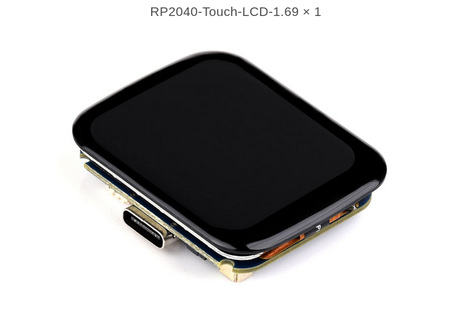
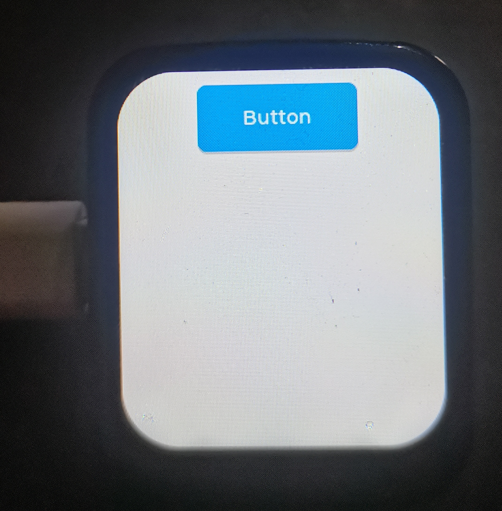

# Read me——lvgl for RP2040-Touch-LCD-1.69

#### **基于微雪电子RP2040微控制器双核ARM触摸液晶开发板 带1.69寸圆角LCD触控屏幕16MB Flash 小板型加速度与陀螺仪传感器开发板的lvgl移植项目。**

#### 简介：

- 该项目基于微雪电子RP2040微控制器双核ARM触摸液晶开发板 带1.69寸圆角LCD触控屏幕16MB Flash 小板型加速度与陀螺仪传感器开发板，实现了**lvgl_8.3.11**版本的移植。
- 尽管微雪电子提供了LVGL的版本，但是本项目旨在通过此项目阐述RP2040通用情况下的lvgl的移植情况。并且移植8.3.11版本的lvgl旨在使用NXP公司的Gui-guider软件自动生成C代码进行开发，**但是这一步尚未实现，目前不清楚是什么原因导致的这一步暂时实现不了。**
- 这个项目展示了lvgl在该开发板上的移植，基于微雪提供的不含lvgl的例程的项目构建。





------

### 使用说明：

1. 克隆这个项目，注意最好将此项目克隆到与你pico-sdk同级的目录。

   ```bash
   git clone https://github.com/zengshuaixiong/lvgl_for_RP2040_Touch_LCD_1.69.git
   ```

2. 将外部引用的lvgl版本进行注册和克隆

   ```bash
   cd lvgl_for_RP2040_Touch_LCD_1.69
   git submodule init
   git submodule update
   ```

3. 进行组建，注意第三条语句设置pico-sdk-path的路径，自由设置。

   ```bash
   mkdir build
   cd build
   export PICO_SDK_PATH=../../pico-sdk
   cmake ..
   make
   ```

4. 烧录uf2文件即可，本项目并没有配置Vscode环境。

------

### 代码结构：

- examples文件夹下面的LCD_1in69_test.c为主要文件，主函数仅调用该文件中的LCD_1in69_test()函数。该函数仅使能了lvgl的相关功能。

  ```c
  int LCD_1in69_test(void)
  {
  
      if (DEV_Module_Init() != 0)
      {
          return -1;
      }
      /* LCD Init */
      printf("1.69inch LCD demo...\r\n");
      DEV_SET_PWM(100);
      LCD_1IN69_Init(VERTICAL);
      
      DEV_IRQ_SET(DEV_I2C_INT, GPIO_IRQ_EDGE_RISE | GPIO_IRQ_EDGE_FALL, true, &Touch_INT_callback);
      
      UDOUBLE Imagesize = LCD_1IN69_HEIGHT * LCD_1IN69_WIDTH * 2;
      if ((BlackImage = (UWORD *)malloc(Imagesize)) == NULL)
      {
          printf("Failed to apply for black memory...\r\n");
          exit(0);
      }
      
      /*1.Create a new image cache named IMAGE_RGB and fill it with white*/
      Paint_NewImage((UBYTE *)BlackImage, LCD_1IN69_WIDTH, LCD_1IN69_HEIGHT, 90, WHITE);
      Paint_SetScale(65);
      Paint_Clear(WHITE);
      DEV_Delay_ms(1000);
      
      
      
      lv_init();t
      lv_port_disp_init();
      lv_example_get_started_1();
      
      //这里是NXP使能的函数，但是并没有成功。
      //setup_ui(&guider_ui); //using the NXP GUI_guider's ui
      //events_init(&guider_ui); //using the NXP GUI_guider's ui
     
      
      
     while (true)
      {
          DEV_Delay_ms(30);   /*Sleep for 30 millisecond*/
          lv_task_handler();
          lv_tick_inc(30);      /*Tell LVGL that 30 milliseconds were elapsed*/
      }
  }
  ```

- lib文件夹下porting文件夹为显示与lvgl的移植，通过lv_port_disp.c实现，仅实现的画点函数的移植，无硬件加速。

------

#### 可能会遇到的组建错误

如果在make阶段遇到了以下错误：

```bash
/usr/lib/gcc/arm-none-eabi/10.3.1/../../../arm-none-eabi/bin/ld:/home/oscar/pico/pico-sdk/src/rp2_common/pico_crt0/rp2040/memmap_default.ld:218 cannot move location counter backwards (from 0000000020095120 to 0000000020040000)
collect2: error: ld returned 1 exit status
make[2]: *** [CMakeFiles/main.dir/build.make:1444：main.elf] 错误 1
make[1]: *** [CMakeFiles/Makefile2:1901：CMakeFiles/main.dir/all] 错误 2
make: *** [Makefile:136：all] 错误 2
```

那并不是你的代码错误（当然也不能这么说），仅仅是因为pico默认组建的RAM空间比较小，只有256K，但这个项目配上lvgl所使用的RAM超过空间了。该错误可以帮你定向到memmap_default.ld文件，打开这个文件即可，找到下面的几条语句。实际上我认为这就是在修改堆栈空间的大小。

```bash
MEMORY
{
    INCLUDE "pico_flash_region.ld"
    RAM(rwx) : ORIGIN =  0x20000000, LENGTH = 256K
    SCRATCH_X(rwx) : ORIGIN = 0x20040000, LENGTH = 4k
    SCRATCH_Y(rwx) : ORIGIN = 0x20041000, LENGTH = 4k
}
```

把上述的256K无脑改成1M就可以了，下面两个地址也可以改一下，避免内存映射冲突了。

```bash
MEMORY
{
    INCLUDE "pico_flash_region.ld"
    RAM(rwx) : ORIGIN =  0x20000000, LENGTH = 1M
    SCRATCH_X(rwx) : ORIGIN = 0x20040000, LENGTH = 4k
    SCRATCH_Y(rwx) : ORIGIN = 0x20041000, LENGTH = 4k
}
```

------

#### 分支clock

- 更新了分支clock，其表现为在屏幕上显示一个钟表表盘和指针，暂且没有移植RTC。
